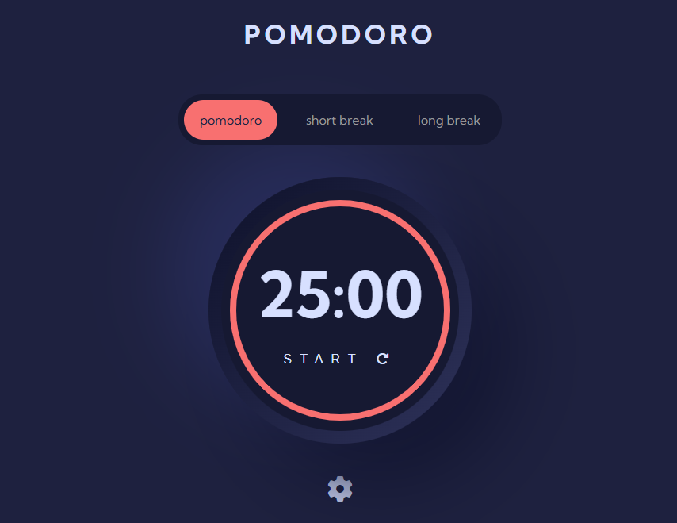
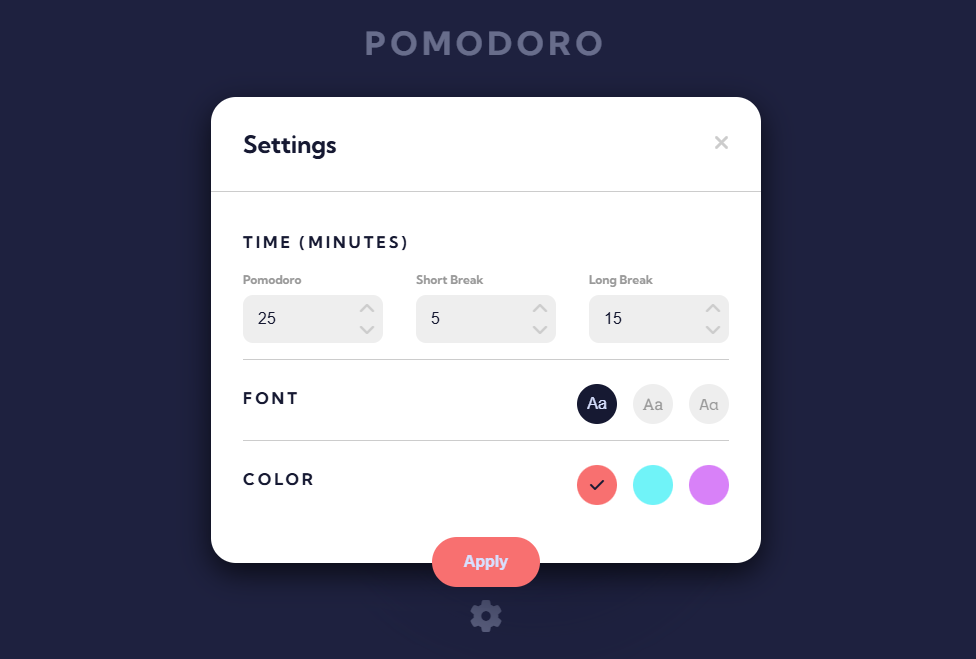

# Pomodoro App
*A web-based Pomodoro timer with customizable session lengths, font choices, and color themes. Built using HTML, CSS, and vanilla JavaScript, this project demonstrates how to create an interactive, animated countdown timer that users can personalize via a settings panel.*

  
  

## Features

- **Multiple Timer Modes**:  
  - Pomodoro (default 25 minutes)  
  - Short Break (default 5 minutes)  
  - Long Break (default 15 minutes)  

- **Start / Pause / Continue / Restart Controls**:  
  - Click “Start” to begin; “Pause” to pause; “Continue” to resume; and a rotate icon to restart the current session.

- **Customizable Settings Panel**:  
  - Adjust session lengths for Pomodoro, Short Break, and Long Break.  
  - Choose from three font families (Kumbh Sans, Roboto Slab, Space Mono).  
  - Select one of three accent colors (red, blue, purple).  
  - Settings apply immediately and persist until the next reload.

- **Responsive Design**:  
  - Optimized for desktop and tablet viewports (collapses gracefully on smaller screens).

## Usage

1. Select “Pomodoro”, “Short Break” or “Long Break” at the top tabs.
2. Click **Start** to begin the countdown, **Pause** to pause, and **Continue** to resume.
3. Click the 🔄 icon to immediately restart the current session.
4. Click the ⚙️ gear icon to open **Settings**, where you can:
   - Change session lengths
   - Pick a font (Kumbh Sans, Roboto Slab, Space Mono)
   - Choose an accent color (red, blue, purple)
5. Click **Apply** in Settings to save changes and reset the timer.